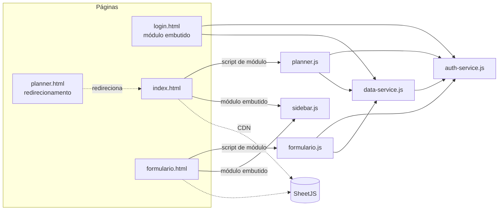
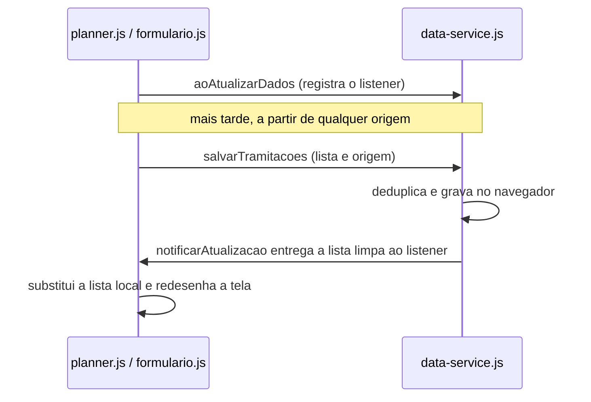
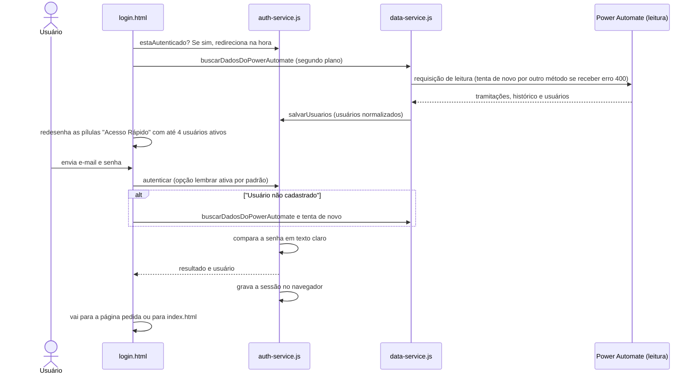
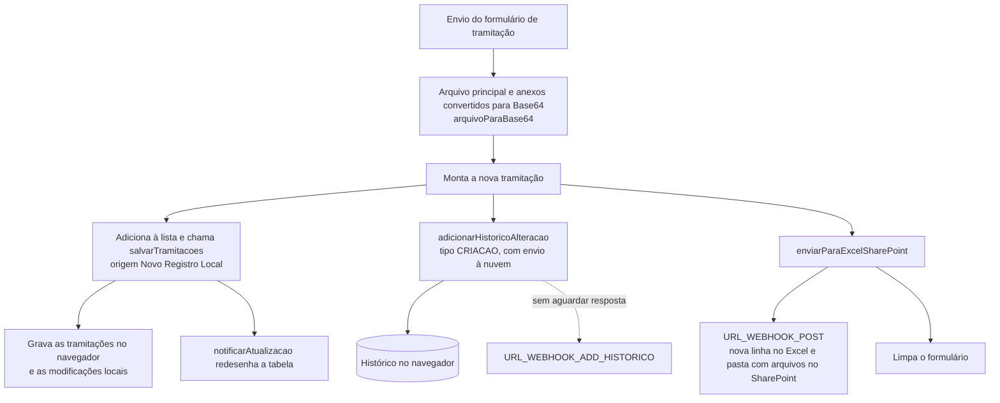
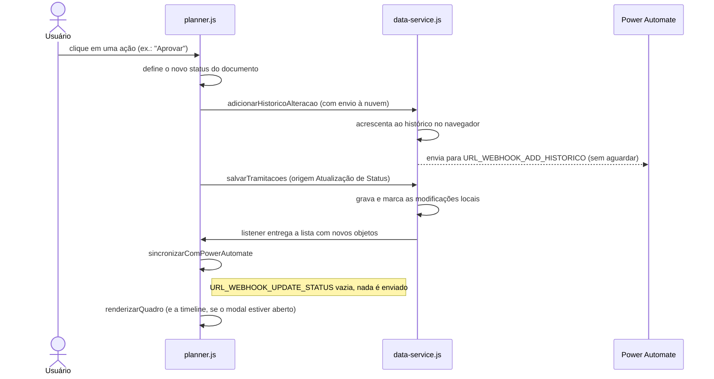
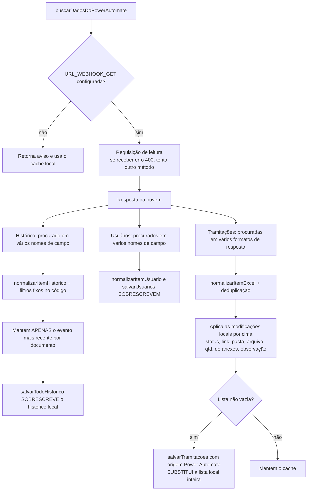

# 02 — Estrutura do código do DocFlow

Documento técnico para quem vai manter o DocFlow, o sistema de tramitação de documentos.
Este documento descreve a organização do projeto e cita arquivos, funções e chaves apenas pelo nome. Para ver a implementação, abra o arquivo indicado.

> **Sobre segredos:** este documento cita os webhooks do Power Automate **apenas pelo nome da constante**. As URLs reais carregam assinatura e funcionam como credencial. Não as copie para documentação, tickets ou chats. Pelo mesmo motivo, as senhas também não aparecem aqui.

---

## 1. Stack e dependências externas

| Item | Detalhe |
|---|---|
| Linguagem | HTML5, CSS3 e JavaScript (ES2020+) puros |
| Módulos | ES modules nativos do navegador, **sem bundler e sem etapa de build** |
| Framework | Nenhum (manipulação direta do DOM e templates montados como texto) |
| Persistência | localStorage e sessionStorage do navegador |
| Backend | Não há servidor próprio. A "nuvem" são fluxos do **Power Automate** (gatilho HTTP) que leem e gravam em uma planilha **Excel no SharePoint** e criam pastas e arquivos em uma biblioteca do SharePoint |
| package.json / testes / lint | Não existem |

### Dependências via CDN

| Dependência | Onde é carregada | Uso |
|---|---|---|
| **SheetJS (xlsx, versão 0.18.5)**, via jsDelivr | index.html e formulario.html (script clássico, que expõe o objeto global XLSX) | Importar planilhas .xlsx, .xls e .csv (importarArquivoExcel) e exportar a base com várias abas (exportarPlanilhaCompletaExcel) |
| **Google Fonts (Inter)** | login.html, index.html e formulario.html | Tipografia |

Observações:
- login.html **não** carrega o SheetJS, mas importa data-service.js. Funciona porque as funções que dependem do SheetJS não são chamadas no login.
- O CDN não usa verificação de integridade (SRI). Veja a seção [12](#12-pontos-de-atenção-técnicos).

---

## 2. Árvore de diretórios comentada

Raiz: **tramitacao_de_documentos/**

- **.vscode/settings.json**: porta do Live Server (5501).
- **doc_projeto/**: documentação do projeto (inclui este documento).
- **login.html**: tela de login. Um script de módulo embutido na página importa auth-service e data-service.
- **index.html**: "Painel", com KPIs de prazo, quadro Kanban e modais (detalhes, edição, cancelados, auditoria).
- **formulario.html**: "Novo Registro", com o formulário de cadastro de documento, a tabela e a exportação CSV.
- **planner.html**: LEGADO. Só redireciona para index.html (o Planner foi unificado ao Painel).
- **paleta.css**: tokens de design (cores primitivas, variações suaves, superfícies).
- **formulario.css**: folha de estilos principal (cerca de 4.500 linhas; usada por login, index e formulario), incluindo o tema escuro.
- **auth-service.js**: usuários, autenticação, sessão e proteção de rotas.
- **data-service.js**: núcleo. Persistência, normalização, histórico, sincronização com o Power Automate, tema e menu de configurações.
- **formulario.js**: lógica da página formulario.html.
- **planner.js**: lógica da página index.html (Kanban, modais, histórico e timeline).
- **sidebar.js**: sidebar colapsável (usada por index.html e formulario.html).

> **Atenção ao nome:** planner.js é o script do **index.html**, e não do planner.html.

---

## 3. Responsabilidade de cada arquivo

| Arquivo | Responsabilidade |
|---|---|
| login.html | Formulário de login, botão de tema, "Acesso Rápido para Teste" (pílulas que preenchem e-mail e senha), sincronização em segundo plano dos usuários da nuvem e redirecionamento para a página pedida no parâmetro redirect |
| index.html | Estrutura do Painel: 4 KPIs (total, vencendo, atrasado, aprovado), filtros, 5 colunas do Kanban (recebido, revisão, devolvido, aprovação, aprovado) e os modais de detalhes, cancelados e auditoria. A lista de status válidos fica no seletor de nova etapa e no formulário de edição |
| formulario.html | Formulário de tramitação (campos do documento, arquivo principal obrigatório e anexos), abas "Novo Documento" / "Revisão Técnica", tabela de registros e botão de exportar |
| planner.html | Página de redirecionamento para não quebrar favoritos antigos |
| paleta.css | Variáveis de cor (família "--cor-") |
| formulario.css | Todo o restante do visual: layout, sidebar, Kanban, modais, login, toasts e tema escuro |
| auth-service.js | Base de usuários (cache local + usuários-padrão embutidos), login, sessão, logout, guarda de rota e badge do usuário. Também publica o objeto global DocFlowAuth |
| data-service.js | Webhooks, CRUD local de tramitações, deduplicação, *listeners* de atualização, histórico de alterações, normalização de linhas do Excel, importação e exportação de planilhas, sincronização com o Power Automate, envio de arquivos ao SharePoint, tema claro/escuro, toast e menu de configurações do cabeçalho. Também publica os globais DocFlowDataService e mostrarNotificacaoToast |
| formulario.js | Cadastro de nova tramitação (conversão de arquivos para Base64, envio ao Power Automate, evento de histórico CRIACAO), tabela de registros, exportação CSV e pré-preenchimento com o usuário logado |
| planner.js | Kanban de 5 colunas + modal de cancelados, KPIs de prazo, busca e filtro por área, modal de detalhes (edição, link manual do SharePoint, upload de anexos, ações rápidas de status), timeline "rio", modal de auditoria, diálogos customizados e toast com "Desfazer" |
| sidebar.js | Colapsar/expandir a sidebar (preferência salva no navegador) e posicionar o "recorte" visual do link ativo |

---

## 4. Principais funções por módulo

### 4.1 auth-service.js

| Nome | Descrição |
|---|---|
| CHAVE_USUARIOS / CHAVE_SESSAO | Nomes das chaves de armazenamento de usuários e sessão |
| USUARIOS_PADRAO | Usuários iniciais embutidos no código (com senha em texto claro) |
| obterUsuarios | Lê a lista de usuários salva. Se estiver vazia, grava e retorna os usuários-padrão |
| salvarUsuarios | Persiste a lista de usuários |
| normalizarItemUsuario | Converte uma linha da aba "Usuários" do Excel (nomes de coluna tolerantes a acento e caixa) em um usuário |
| autenticar | Busca por e-mail **ou nome**, checa o status e compara a senha em texto claro. Grava a sessão de forma persistente (opção "lembrar", padrão) ou só na aba atual |
| obterUsuarioAtual | Lê a sessão (primeiro a persistente, depois a da aba) |
| estaAutenticado | Indica se existe usuário na sessão |
| fazerLogout | Remove a sessão dos dois armazenamentos e redireciona para login.html |
| protegerPagina | Guarda de rota no cliente: sem sessão, redireciona para o login informando a página de retorno |
| configurarHeaderUsuario | Cria ou atualiza o badge do usuário na área direita do cabeçalho |
| DocFlowAuth (global) | Exposição global das funções acima |

### 4.2 data-service.js

**Configuração e estado**

| Nome | Descrição |
|---|---|
| URL_WEBHOOK_POST, URL_WEBHOOK_GET, URL_WEBHOOK_UPDATE_STATUS, URL_WEBHOOK_ADD_HISTORICO | Webhooks do Power Automate (veja a seção [10](#10-integração-com-power-automate)) |
| CHAVE_STORAGE, CHAVE_ULTIMA_SINC, CHAVE_ORIGEM, CHAVE_MODIFICACOES_LOCAIS, CHAVE_HISTORICO | Chaves de armazenamento local (só CHAVE_HISTORICO é exportada) |
| ouvintesAtualizacao | Lista de *callbacks* do padrão observer |

**Tramitações e sincronização**

| Nome | Descrição |
|---|---|
| gerarIdDocumento | ID estável: usa o ID do item; senão "DOC-" + código; senão "DOC-" + título em maiúsculas sem espaços (até 25 caracteres); senão "DOC-ITEM-" + posição |
| obterModificacoesLocais | Lê o registro de modificações locais |
| desduplicarTramitacoes | Consolida por código (ou título, em minúsculas) e mescla campos. **Retorna objetos novos** |
| aoAtualizarDados | Registra um *listener* |
| notificarAtualizacao | **Não exportada**. Chamada apenas por salvarTramitacoes |
| obterTramitacoes | Lê as tramitações já deduplicadas |
| salvarTramitacoes | Deduplica, grava, atualiza a última sincronização e a origem, registra "modificações locais" (se a origem não for a nuvem) e notifica os *listeners* |
| obterInfoSincronizacao | Última sincronização, origem e total, para o menu |
| normalizarItemExcel | Converte uma linha do Excel/Power Automate em tramitação. Usa a função interna normalizarData, que trata o número serial de data do Excel, DD/MM/AAAA e ISO |
| importarArquivoExcel | Lê o arquivo com o SheetJS e detecta pelo nome as abas de tramitações, histórico e usuários |
| exportarPlanilhaCompletaExcel | Gera um .xlsx com 3 abas (Tramitações, Histórico de Alterações, Usuários). Só é acessível pelo global DocFlowDataService |
| buscarDadosDoPowerAutomate | Sincronização nuvem → local (veja o [fluxo 7.4](#74-sincronização-com-a-nuvem)) |
| sanitizarNomePasta | Remove caracteres inválidos para pastas do SharePoint |
| arquivoParaBase64 | Converte um arquivo em nome, tipo, tamanho e conteúdo Base64 |
| enviarArquivosParaSharePoint | Envia os arquivos para URL_WEBHOOK_POST. Retorna o link e o nome da pasta |

**Histórico de alterações**

| Nome | Descrição |
|---|---|
| obterTodoHistorico / salvarTodoHistorico | Leitura e gravação do histórico de alterações |
| obterHistoricoDocumento | Filtra pelo ID do documento, código ou ID (ignorando o prefixo "doc-") e ordena por data/hora crescente |
| adicionarHistoricoAlteracao | Cria o registro (seção [8.2](#82-registro-de-histórico)), grava localmente e, se a opção de envio à nuvem estiver ativa, envia para URL_WEBHOOK_ADD_HISTORICO sem aguardar resposta |
| inicializarHistoricoSeNecessario | Cria um evento CRIACAO sintético se o documento não tiver histórico |
| normalizarItemHistorico | Converte uma linha da aba Histórico em registro de histórico |
| limparHistoricoManterUltimos | **Utilitário de manutenção** que substitui todo o histórico por 3 registros fixos no código. Só é acessível pelo global DocFlowDataService |

**UI compartilhada**

| Nome | Descrição |
|---|---|
| obterTemaAtual / definirTema / aplicarTemaSalvo | Tema claro/escuro (chave docflow_theme). É aplicado automaticamente quando o módulo é carregado |
| mostrarNotificacaoToast | Toast discreto. Também fica disponível como global |
| inicializarMenuConfiguracoes | Monta o dropdown da engrenagem: usuário, tema, "Sincronizar Nuvem", "Carregar Excel" e logout |
| inicializarBarraSincronizacao | **Legado**. Delega para inicializarMenuConfiguracoes |
| DocFlowDataService (global) | Exposição global (útil no console do navegador) |

### 4.3 formulario.js (sem exports; todo o código roda numa função autoexecutável)

| Função | Descrição |
|---|---|
| protegerPagina (chamada) | Guarda de rota |
| getStatusBadge | Monta o badge de status da tabela |
| renderizarTabela | Monta a tabela de registros |
| sanitizarNomePasta / arquivoParaBase64 | **Duplicatas** das funções de data-service.js |
| enviarParaExcelSharePoint | Envia para URL_WEBHOOK_POST (cria a linha no Excel e a pasta com os arquivos) |
| Tratamento do envio do formulário | Fluxo de cadastro (seção [7.2](#72-cadastro-de-documento-formulariohtml)) |
| Exportação CSV | Gera tramitacao_documentos.csv (separador ponto e vírgula, com BOM UTF-8) |
| Abas Novo/Revisão | Ajustam o campo de revisão (0 ou 1) |
| aplicarDadosUsuarioLogado | Preenche remetente e área com os dados da sessão |

### 4.4 planner.js (sem exports; todo o código roda numa função autoexecutável)

| Função | Descrição |
|---|---|
| classificarColuna | Mapeia o texto de status para a coluna recebido, revisão, devolvido, aprovação, aprovado ou cancelado (por trecho de texto, sem acento) |
| obterBadgeClassStatus | Classe visual do badge (mesma lógica) |
| calcularStatusPrazo | Classifica o prazo em atrasado, vencendo (0 a 5 dias) ou ok |
| contarDevolucoes | Conta eventos "devolvido" no histórico (indicador de retrabalho) |
| sincronizarComPowerAutomate | Envia código, título e status para URL_WEBHOOK_UPDATE_STATUS. **Hoje não faz nada**, porque a constante está vazia |
| atualizarKPIs | Calcula os 4 KPIs |
| mostrarDialogoConfirmacao / mostrarDialogoAlerta / mostrarToastDesfazer | Diálogos e toast próprios, expostos como globais |
| Salvamento da edição no modal | Compara campo a campo, gera histórico EDICAO ou STATUS e salva |
| Salvar link manual | Define o link da pasta à mão |
| Enviar anexos | Chama enviarArquivosParaSharePoint e atualiza link, nome da pasta e quantidade de anexos |
| abrirModalDetalhes (global) | Preenche o modal e gera os botões de ação rápida de acordo com a coluna |
| renderizarRiverTimeline | Timeline vertical + formulário "Registrar Alteração" (com o botão de salvar nova etapa) |
| moverStatus (global) | Muda o status, gera histórico (STATUS ou CANCELAMENTO), salva e sincroniza |
| solicitarCancelamentoDocumento (global) | Confirmação, depois cancelamento com toast "Desfazer" de 4 s |
| criarCartao / criarCartaoCancelado | Montam os cards |
| renderizarQuadro | Aplica busca e filtro, distribui por coluna e atualiza KPIs e contadores |
| abrirModalAuditoria (global) | Histórico completo com as diferenças de cada edição |

### 4.5 sidebar.js

| Nome | Descrição |
|---|---|
| CHAVE_ARMAZENAMENTO | Chave docflow_sidebar_colapsada |
| posicionarRecorte | Posiciona o recorte côncavo sobre o link ativo (interna) |
| aplicarEstadoSidebar | Alterna o estado colapsado (interna) |
| inicializarSidebar | **Único export**. Chamado por um módulo embutido em index.html e formulario.html |

---

## 5. Grafo de imports

Dependências de cada import:

| Importador | De auth-service.js | De data-service.js |
|---|---|---|
| data-service.js | normalizarItemUsuario, salvarUsuarios, obterUsuarios, obterUsuarioAtual, fazerLogout | — |
| formulario.js | protegerPagina, configurarHeaderUsuario, obterUsuarioAtual | obterTramitacoes, salvarTramitacoes, aoAtualizarDados, inicializarBarraSincronizacao*, inicializarMenuConfiguracoes, buscarDadosDoPowerAutomate, URL_WEBHOOK_POST, adicionarHistoricoAlteracao |
| planner.js | protegerPagina, configurarHeaderUsuario, obterUsuarioAtual | obterTramitacoes, salvarTramitacoes, aoAtualizarDados, inicializarBarraSincronizacao*, inicializarMenuConfiguracoes, buscarDadosDoPowerAutomate, URL_WEBHOOK_UPDATE_STATUS, arquivoParaBase64, enviarArquivosParaSharePoint, obterHistoricoDocumento, adicionarHistoricoAlteracao, inicializarHistoricoSeNecessario, gerarIdDocumento |
| login.html (módulo embutido) | autenticar, obterUsuarios, obterUsuarioAtual, estaAutenticado | definirTema, obterTemaAtual, buscarDadosDoPowerAutomate |

\* importado, mas não usado.

Não há dependência circular: auth-service.js não importa nada.

### Padrão de *listeners* (observer)

O *listener* substitui a lista local de tramitações por **novos objetos**, porque a deduplicação cria cópias. Não guarde referências a itens antigos depois de um salvarTramitacoes. O código atual contorna isso relocalizando o item aberto no modal pela sua chave.

---

## 6. Ordem de inicialização de uma página protegida

1. Um script embutido no cabeçalho da página aplica o tema salvo em docflow_theme, evitando o "flash" do tema claro.
2. O SheetJS é carregado via CDN.
3. O módulo da página (planner.js ou formulario.js) importa auth-service e data-service. Ao ser carregado, o data-service já aplica o tema salvo (aplicarTemaSalvo).
4. protegerPagina redireciona para o login se não houver sessão. O resto do script **continua executando** até o navegador trocar de página.
5. O script lê o cache (obterTramitacoes), registra o *listener* (aoAtualizarDados), desenha a tela e configura o cabeçalho e o menu.
6. buscarDadosDoPowerAutomate roda em segundo plano. Ao terminar, salvarTramitacoes dispara os *listeners* e a tela é desenhada de novo.

---

## 7. Fluxos de dados

### 7.1 Login

A lógica está no módulo embutido de login.html (redirecionamento inicial, sincronização inicial e envio do formulário) e na função autenticar de auth-service.js.

### 7.2 Cadastro de documento (formulario.html)

> "Cadastro", aqui, é o **registro de um documento**. Não existe tela de cadastro de usuário: os usuários vêm da planilha (aba Usuários), por importação de Excel ou por sincronização.

Observações:
- O registro é salvo **localmente antes** do envio. Se o envio falhar, só aparece um erro no console: o usuário não é avisado e o documento fica apenas no cache local.
- O link da pasta é calculado no cliente, juntando uma URL base fixa da biblioteca do SharePoint com o nome da pasta. Não é o link devolvido pelo fluxo.
- Os dados enviados repetem os mesmos campos com vários nomes (por exemplo, "Título", "Código do documento" e três grafias de "Link Anexo") e ainda incluem todos os campos originais no final. Isso existe para casar com o esquema do fluxo.

### 7.3 Dashboard e mudança de status (index.html + planner.js)

Mapeamento de status para coluna (feito por classificarColuna, comparando o texto sem acento e em minúsculas):

| Regra (a primeira que casar) | Coluna |
|---|---|
| igual a "cancelado" | **cancelado** (fora do quadro, no modal "Cancelados") |
| igual a "aprovado" ou "aprovacao final" | **aprovado** |
| contém "aprovacao" | **aprovação** |
| contém "devolvido" ou "solicitante", ou igual a "pendente" | **devolvido** |
| igual a "recebido" (ou vazio) | **recebido** |
| qualquer outro | **revisão** |

Existem três caminhos para mudar o status:

1. **Ações rápidas** do modal / **Reativar** → função moverStatus.
2. **"Registrar Alteração"** na timeline (com destino/responsável obrigatório para status de devolução ou aprovação) → botão de salvar nova etapa, em renderizarRiverTimeline.
3. **Edição completa** do documento → salvamento da edição no modal (gera EDICAO ou STATUS, com a lista de campos alterados nos detalhes).

**Consequência prática:** hoje a mudança de status **não atualiza a linha da tramitação no Excel**. Ela só grava um evento na aba de histórico, via URL_WEBHOOK_ADD_HISTORICO. O status "vence" localmente graças às modificações locais (docflow_modificacoes_locais; veja 7.4).

KPIs (atualizarKPIs): total ativo (não aprovado), vencendo (0 a 5 dias até a data de revisão), atrasado e aprovados. O rótulo "concluídos este mês" **não filtra por mês**: conta todos os aprovados.

### 7.4 Sincronização com a nuvem

Disparada no carregamento de login.html, index.html e formulario.html e pelo botão "Sincronizar Nuvem" do menu.

Pontos importantes:
- **Última escrita local vence, para sempre.** Todo salvamento com origem local grava nas modificações locais os campos de **todos** os itens da lista, e não só do item alterado. Na próxima sincronização, esses valores se sobrepõem aos da nuvem. Resultado: depois de qualquer ação local, mudanças de status feitas direto no Excel deixam de aparecer naquele navegador. Isso também vale para a importação de arquivo Excel, cuja origem é "Arquivo: " seguido do nome.
- **Itens só locais somem.** Se o cadastro não chegou ao Excel (envio falhou), a próxima sincronização substitui a lista e o documento desaparece.
- **O histórico é reduzido a 1 evento por documento**, o que apaga a timeline local e zera a contagem de devoluções (contarDevolucoes). Os filtros especiais "monto-001" e "suprimento"/"muen"/"muem" estão fixos no código.

### 7.5 Importação e exportação de planilha

- **Importar** (menu → "Carregar Excel"): importarArquivoExcel escolhe as abas pelo nome. Nomes com "historico", "alteraco" ou "log" vão para o histórico (mesclado por ID); "usuario" ou "user", para os usuários (**substitui**); "tramitac", "base" ou "document", para as tramitações. Por padrão, a aba principal é a primeira. As tramitações importadas **substituem** a lista local.
- **Exportar CSV** (formulario.js): só as tramitações.
- **Exportar XLSX completo** (exportarPlanilhaCompletaExcel): não há botão na tela. Chame a função pelo global DocFlowDataService no console do navegador. **A aba Usuários sai com a coluna Senha.**

---

## 8. Modelo de dados

### 8.1 Objeto de tramitação

Formato produzido por normalizarItemExcel e pelo formulário de cadastro:

| Campo | Tipo | Origem / regra |
|---|---|---|
| id | texto | Coluna ID do Excel; senão "DOC-" + código; senão "DOC-" + marca de tempo. **O formulário não define o ID**: ele é gerado em desduplicarTramitacoes, via gerarIdDocumento |
| titulo | texto | Padrão "Sem Título" |
| codigo | texto | Chave de negócio (usada na deduplicação e nas modificações locais) |
| status | texto | Texto livre. Padrão "Em Revisão" (Excel) ou o valor escolhido no formulário. A lista de opções está em index.html |
| tipoDocumento | texto | Ex.: "PR - Procedimento". Padrão "Procedimento" na importação |
| revisao | texto | Nº de revisão. Padrão "0" |
| dataRecebimento | data AAAA-MM-DD | Normalizada (serial do Excel, DD/MM/AAAA e ISO) |
| dataRevisao | data AAAA-MM-DD | **Prazo** usado nos KPIs e nos cards |
| remetente | texto | Pré-preenchido com o nome do usuário logado |
| area | texto | Pré-preenchida com a área do usuário. Usada no filtro |
| disciplina | texto | |
| observacao | texto | |
| linkAnexo | texto (URL) | Pasta do documento no SharePoint |
| nomePasta | texto | Título tratado por sanitizarNomePasta |
| nomeArquivoPrincipal | texto | |
| qtdAnexos | número | |

Chave de identidade: o código sem espaços nas pontas e em minúsculas, ou o título quando não há código. **Dois documentos com o mesmo título e sem código são fundidos em um.**

### 8.2 Registro de histórico

Criado por adicionarHistoricoAlteracao e por normalizarItemHistorico:

| Campo | Tipo | Descrição |
|---|---|---|
| id | texto | "HIST-" + marca de tempo + 5 caracteres aleatórios |
| idDocumento | texto | ID da tramitação ("DOC-...") |
| codigo | texto | Código do documento |
| status | texto | Status **após** o evento |
| statusAnterior | texto | Status antes |
| dataHora | data/hora ISO 8601 | Usado para ordenar |
| dataExibicao | texto DD/MM/AAAA HH:mm | Hora local de quem gerou |
| destino | texto | Para onde o documento foi (ex.: "Custos / Qualidade"). Padrão "Qualidade" |
| responsavel | texto | Responsável atribuído |
| autor | texto | Quem realizou a ação |
| tipoAcao | lista fixa | CRIACAO, STATUS, EDICAO, CANCELAMENTO (e ANEXO, que tem exibição prevista na auditoria, mas **nunca é gerado**) |
| detalhes | vazio ou lista de campo / antes / depois | Diferenças da edição (gravadas como JSON na exportação) |
| observacao | texto | Texto livre |

### 8.3 Usuário e sessão

- **Usuário**: id, nome, email (minúsculo), senha (**texto claro**; padrão fixo quando vazia), perfil (Administrador, Solicitante, Qualidade...), area e status (Ativo/inativo).
- **Sessão**: id, nome, email, perfil, area e marca de tempo. Não tem senha nem expiração.
- O perfil **não é usado para autorização** em nenhum lugar: todos os usuários podem tudo.

---

## 9. Chaves de armazenamento do navegador

| Chave | Armazenamento | Definida em | Conteúdo |
|---|---|---|---|
| tramitacoes | localStorage | data-service.js | Lista de tramitações (deduplicada) |
| docflow_historico_alteracoes | localStorage | data-service.js | Lista de registros de histórico |
| docflow_modificacoes_locais | localStorage | data-service.js | Mapa por documento com status, link, pasta, arquivo principal, quantidade de anexos, observação e marca de tempo, que se sobrepõe à nuvem |
| docflow_ultima_sincronizacao | localStorage | data-service.js | Data/hora da última gravação (de **qualquer** origem, não só da sincronização) |
| docflow_origem_dados | localStorage | data-service.js | Rótulo da origem da última gravação ("Power Automate (SharePoint)", "Arquivo: x.xlsx", "Atualização de Status"...) |
| docflow_usuarios | localStorage | auth-service.js | Lista de usuários **com senhas** |
| docflow_sessao_usuario | localStorage **ou** sessionStorage | auth-service.js | Sessão. Vai para o sessionStorage só quando a opção "lembrar" está desligada, o que nenhuma tela faz hoje |
| docflow_theme | localStorage | data-service.js (também lida pelo script de tema no cabeçalho das páginas) | "light" ou "dark" |
| docflow_sidebar_colapsada | localStorage | sidebar.js | "1" ou "0" |

Para "resetar" um navegador: limpe essas chaves nas ferramentas de desenvolvedor (Application → Local Storage).

---

## 10. Integração com Power Automate

Todas as constantes ficam em data-service.js. As URLs são gatilhos HTTP diretos do Power Platform com assinatura SAS. **Quem tem a URL tem acesso.**

| Constante | Estado | Chamada por | O que faz |
|---|---|---|---|
| URL_WEBHOOK_POST | Configurada | enviarParaExcelSharePoint (formulario.js, que usa um apelido local da constante) e enviarArquivosParaSharePoint (data-service.js, usada pelo envio de anexos em planner.js) | Recebe os dados do documento, o documento principal e os anexos complementares em Base64. **Adiciona uma linha** na tabela do Excel e cria a pasta com os arquivos no SharePoint. Pode devolver o link e o nome da pasta |
| URL_WEBHOOK_GET | Configurada | buscarDadosDoPowerAutomate | Lê as tabelas do Excel. Espera as tramitações e, opcionalmente, o histórico e os usuários. Faz a requisição e, se receber erro 400, tenta de novo por outro método |
| URL_WEBHOOK_UPDATE_STATUS | **Vazia** | sincronizarComPowerAutomate (planner.js, via apelido local) | Previsto para atualizar o status da linha existente no Excel com código, título e status. Hoje não envia nada |
| URL_WEBHOOK_ADD_HISTORICO | Configurada | adicionarHistoricoAlteracao, quando o envio à nuvem está ativo | Adiciona uma linha na aba de Histórico com o registro completo (seção 8.2). Não aguarda resposta e não tenta de novo |

As funções consideram o webhook "não configurado" quando a URL está vazia ou contém o marcador COLE_AQUI. Use esse marcador ao publicar um ambiente sem fluxos.

> **Contradição a resolver:** um comentário em data-service.js, junto das constantes, diz para não usar o webhook de cadastro para atualizações. Mesmo assim, o upload de anexos pelo modal (planner.js, via enviarArquivosParaSharePoint) usa URL_WEBHOOK_POST, que **adiciona uma linha**. Dependendo da lógica do fluxo, isso pode duplicar o documento no Excel. A deduplicação no cliente esconde o sintoma, mas a planilha fica suja.

---

## 11. Como rodar e fazer deploy

### Rodar localmente

ES modules **não funcionam abrindo o arquivo direto do disco**: o navegador bloqueia os imports. É preciso um servidor HTTP estático:

- **VS Code + Live Server** (já configurado na porta 5501 em .vscode/settings.json): clique com o botão direito em login.html e escolha "Open with Live Server".
- Ou qualquer servidor estático simples (por exemplo, o servidor HTTP embutido do Python ou o pacote "serve" do npm) rodando na raiz do projeto na porta 5501. Depois, abra login.html em localhost, porta 5501.

Sem internet, o SheetJS e a fonte não carregam. O app abre, mas a importação e a exportação de .xlsx e a sincronização falham.

Para testar sem tocar nos fluxos de produção, esvazie temporariamente as constantes de webhook ou coloque nelas o marcador COLE_AQUI. **Não faça commit dessa troca por engano, nem o contrário.**

### Deploy

Não há pipeline, build nem configuração de hospedagem no repositório. Como é um site estático, o deploy é **copiar os arquivos** HTML, CSS e JS para qualquer hospedagem estática com HTTPS: GitHub Pages, SharePoint/Teams (como página), Azure Static Web Apps, IIS etc. Requisitos:
- Servir os arquivos JS com o tipo MIME de JavaScript (necessário para módulos).
- A origem do site precisa ser aceita pelo CORS dos gatilhos HTTP do Power Automate.
- Lembre que os dados ficam **por navegador**: cada usuário e máquina tem o próprio cache, e a "verdade" compartilhada é a planilha.

---

## 12. Pontos de atenção técnicos

### 12.1 Segurança (prioridade alta)

1. **Autenticação só no cliente e senhas em texto claro.** As senhas estão fixas em USUARIOS_PADRAO (auth-service.js), no armazenamento do navegador (docflow_usuarios), na planilha (aba Usuários) e na exportação XLSX. A comparação é feita no navegador, na função autenticar. Qualquer usuário pode ler as senhas nas ferramentas de desenvolvedor.
2. **Senhas expostas na tela de login.** As pílulas de "Acesso Rápido" são fixas no HTML de login.html e depois recriadas com a senha de até 4 usuários vindos da nuvem, **antes do login**.
3. **Webhooks assinados no código-fonte.** Quem abre o site obtém as URLs assinadas. Com URL_WEBHOOK_GET, dá para baixar a planilha inteira, **incluindo a aba de usuários com senhas**, sem login. Com URL_WEBHOOK_POST e URL_WEBHOOK_ADD_HISTORICO, dá para gravar dados arbitrários. O repositório também guarda essas URLs no histórico do Git. **Recomendação:** regenerar as assinaturas dos fluxos, colocar um backend/proxy com autenticação real (por exemplo, Entra ID/MSAL + API) e tirar as senhas da planilha.
4. **A proteção de rota é contornável.** protegerPagina só verifica se existe algum conteúdo em docflow_sessao_usuario. Qualquer valor falso "autentica". A sessão não expira e não tem assinatura.
5. **Sem autorização por perfil.** O perfil é só exibido.
6. **XSS armazenado.** Quase toda a renderização insere HTML montado com dados sem escape (título, observação, remetente, status, detalhes...), por exemplo nos cards e na timeline de planner.js, no modal de auditoria, na tabela de formulario.js e no badge de usuário de auth-service.js. Como os dados vêm da planilha e do formulário, um valor malicioso roda script para todos os usuários que sincronizarem. Há também tratadores de clique embutidos no HTML gerado como texto.
7. **Redirect aberto.** O login redireciona para o endereço do parâmetro redirect sem validar.
8. **CDN sem SRI.** O SheetJS entra sem verificação de integridade em index.html e formulario.html. A versão 0.18.5 do pacote npm xlsx também não recebe mais correções de segurança nesse canal.

### 12.2 Integridade de dados (prioridade alta)

1. **Mudança de status não chega à tabela do Excel.** URL_WEBHOOK_UPDATE_STATUS está vazia. O status só persiste localmente e como evento no histórico.
2. **As modificações locais congelam o estado.** docflow_modificacoes_locais grava todos os itens a cada salvamento local e nunca expira, então mudanças feitas por outras pessoas na planilha deixam de aparecer.
3. **A sincronização destrói o histórico local** (1 evento por documento) e **substitui a lista** de tramitações, apagando cadastros que não chegaram à nuvem.
4. **Falha silenciosa no cadastro.** Erros no envio viram só uma mensagem no console (enviarParaExcelSharePoint).
5. **Upload de anexos usa o webhook de inserção** (seção 10), com risco de linha duplicada no Excel.
6. **Identidade frágil.** Deduplicação por código, ou título quando não há código. As ações do Kanban usam a **posição** do documento na lista (moverStatus e os cliques dos cards): se uma sincronização reordenar ou mesclar itens entre o desenho da tela e o clique, ou durante os 4 s do "Desfazer", a ação cai no documento errado.
7. **Concorrência e multi-dispositivo.** Não há versionamento nem controle de conflito. Cada navegador tem sua própria "verdade".
8. **Limite de tamanho.** Os arquivos vão em Base64 dentro da requisição (cerca de +33%). Anexos grandes podem ultrapassar o limite de requisição do gatilho HTTP do Power Automate. Não há validação de tamanho no cliente.

### 12.3 Débitos técnicos (manutenibilidade)

- **Código duplicado:** sanitizarNomePasta e arquivoParaBase64 existem em formulario.js e em data-service.js; a montagem dos dados enviados ao webhook de cadastro também é repetida nos dois arquivos; a URL base do SharePoint está fixa em 3 lugares (dois em formulario.js e um em data-service.js); a leitura de colunas tolerante a acentos (getCampo) foi copiada 3 vezes (auth-service.js e duas vezes em data-service.js); a lógica de status se repete em classificarColuna, obterBadgeClassStatus, getStatusBadge e no badge da timeline.
- **Referência morta:** o global AuthService com a função obterUsuarioLogado é consultado em data-service.js e em três pontos de planner.js, mas nunca existe. O global real é DocFlowAuth, com obterUsuarioAtual. Em planner.js há alternativa; em data-service.js, o autor vira "Usuário Atual" quando nenhum autor é passado.
- **Imports não usados:** inicializarBarraSincronizacao em formulario.js e planner.js.
- **Argumento ignorado:** configurarHeaderUsuario é chamada com o identificador do badge em formulario.js e planner.js, mas a função não recebe parâmetro.
- **Dados de negócio fixos no código:** limparHistoricoManterUltimos (com nomes e códigos reais) e os filtros "monto-001"/"suprimento"/"muen" na sincronização (data-service.js).
- **Status como texto livre**, com variações de caixa e acento ("Em Revisão" vs "Em revisão da qualidade"). O mapeamento para colunas é heurístico (por trecho de texto). Vale criar uma lista central de status.
- **Listas divergentes:** a lista de tipos do formulário de cadastro (formulario.html) não tem "Memorial Descritivo", que aparece na edição (index.html).
- **KPI "concluídos este mês"** não filtra por data (atualizarKPIs).
- **Tipo de ação ANEXO** tem estilo e rótulo, mas o upload de anexos não registra histórico.
- **Estado global:** várias funções são expostas como globais para uso nos cliques embutidos no HTML (abrirModalDetalhes, moverStatus, fecharModal...). Isso dificulta testes e aumenta o acoplamento.
- **Arquivos grandes:** planner.js (cerca de 1.600 linhas), data-service.js (cerca de 1.300) e formulario.css (cerca de 4.500). O nome formulario.css engana: é a folha global.
- **Sem testes, lint nem README.** Não há package.json.
- **planner.html** pode ser removido quando não houver mais links antigos.
