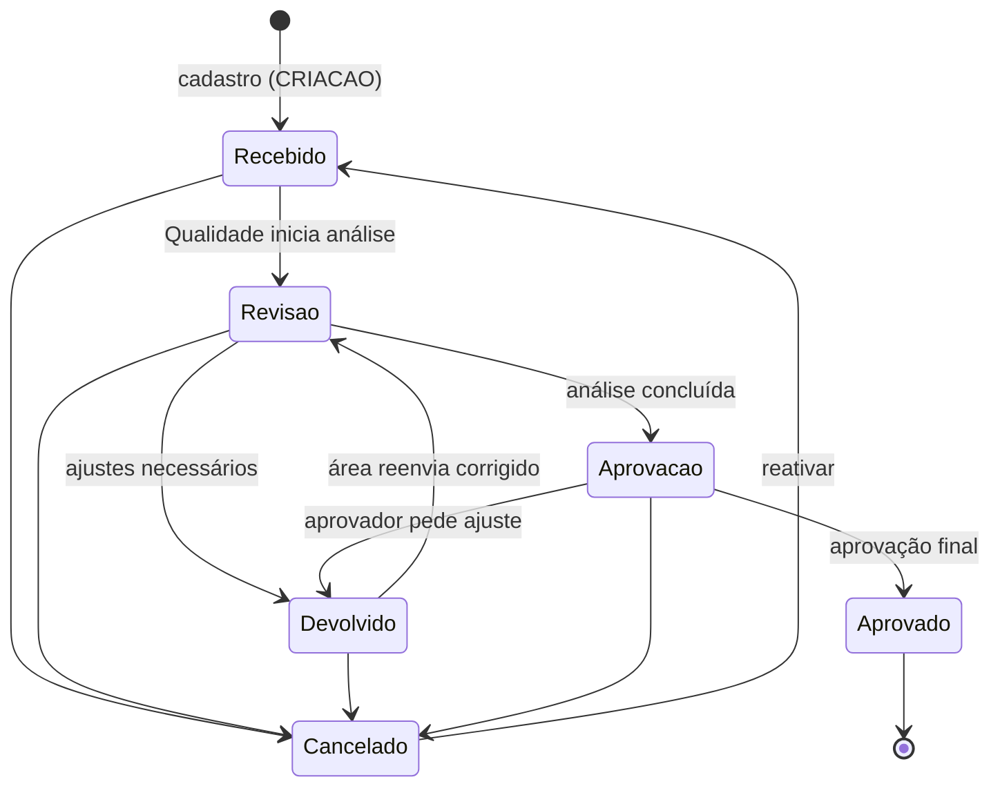

# 02 — Modelo de dados e integrações (especificação para o novo DocFlow)

Especificação técnica para construir o DocFlow do zero, num repositório novo. O texto descreve **como o novo sistema deve ser**. Quando cita o sistema atual, é para registrar uma lição aprendida ou um padrão já validado em produção que deve ser reaproveitado.

Fontes usadas: o modelo de dados do sistema atual, os tipos TypeScript usados na conversão (que refletem os dados reais) e a solução de integridade de sincronização implantada e validada em 28/09/2026.

> **Regra de segredos:** este documento não contém nenhum endereço de integração nem senha real. Não devem aparecer aqui, nem no novo repositório, em momento algum.

---

## 1. Entidades principais

Convenções:
- Datas "só dia" usam o formato **AAAA-MM-DD**. Datas com hora usam **ISO 8601 em UTC** (ex.: 2026-09-28T14:05:00.000Z).
- Campos marcados com **\*** são obrigatórios.

### 1.1 Documento (tramitação)

Um documento do SGI em tramitação entre a área solicitante e a Qualidade.

| Campo | Tipo | Significado |
|---|---|---|
| id \* | texto | Identificador estável do documento, gerado no cadastro (ver seção 2). |
| codigo | texto | Código de negócio do documento (ex.: código do procedimento). Pode estar vazio no cadastro; **não é identidade**. |
| titulo \* | texto | Título do documento. |
| status \* | texto (lista controlada) | Etapa atual da tramitação (ver seção 3). |
| tipoDocumento | texto (lista controlada) | Tipo do documento: "PR - Procedimento", "MP - Mapas / Riscos", "IT - Instrução de Trabalho", "ET - Especificação Técnica", "RL - Relatório", "AT - Ata de Reunião", "LD - Lista de Documentos", "Memorial Descritivo". |
| revisao | texto ou número | Número da revisão do documento ("0" para documento novo). |
| dataRecebimento | data | Dia em que a Qualidade recebeu o documento. |
| dataRevisao | data | **Prazo** da tramitação; base dos indicadores "vencendo" e "atrasado". |
| dataAprovacao | data | Dia da aprovação final. |
| dataInicio | data | Dia em que a análise começou. |
| dataConclusao | data | Dia em que a tramitação foi encerrada. |
| remetente | texto | Nome de quem enviou o documento (preenchido com o usuário logado). |
| area | texto | Área solicitante; usada em filtros e em permissões. |
| disciplina | texto | Disciplina técnica do documento. |
| observacao | texto | Observação livre. |
| linkAnexo | texto (URL) | Endereço da pasta do documento no repositório de arquivos. |
| nomePasta | texto | Nome da pasta do documento, derivado do título sem caracteres inválidos. |
| nomeArquivoPrincipal | texto | Nome do arquivo principal enviado no cadastro. |
| qtdAnexos | número | Quantidade de anexos na pasta. |
| dataModificacao \* | data/hora | Momento da última alteração **deste** documento; base da resolução de conflitos (seção 4.2). |

Observações para a reconstrução:
- O tipo atual aceita campos extras livres, herança da leitura tolerante da planilha. No sistema novo, o esquema deve ser **fechado**: campo desconhecido é rejeitado ou ignorado, nunca gravado.
- status e tipoDocumento hoje são texto livre. No sistema novo devem ser listas controladas (enum ou tabela de domínio), com o rótulo de exibição separado do valor gravado.

### 1.2 Evento de Histórico

Um registro imutável de algo que aconteceu com um documento. É a trilha de auditoria da tramitação.

| Campo | Tipo | Significado |
|---|---|---|
| id \* | texto | Identificador estável do evento, gerado quando o evento é criado. |
| idDocumento \* | texto | id do documento a que o evento pertence. |
| codigo | texto | Código do documento no momento do evento (só informativo). |
| tipoAcao \* | lista fixa | CRIACAO, STATUS, EDICAO, ANEXO ou CANCELAMENTO. |
| status \* | texto | Status do documento **depois** do evento. |
| statusAnterior | texto | Status do documento antes do evento. |
| dataHora \* | data/hora | Momento do evento; ordena a timeline. |
| dataExibicao | texto | Data e hora formatadas (DD/MM/AAAA HH:mm). No sistema novo, **não gravar**: formatar na tela a partir de dataHora. |
| destino | texto | Para onde o documento foi encaminhado (ex.: "Custos / Qualidade"). |
| responsavel | texto | Pessoa responsável pela próxima etapa. |
| autor \* | texto | Quem executou a ação (no sistema novo, vindo da identidade autenticada, nunca digitado). |
| detalhes | lista de { campo, antes, depois } | Diferenças campo a campo, usadas em eventos EDICAO. |
| observacao | texto | Comentário livre da etapa. |

Eventos **nunca são editados nem apagados**. Uma correção é um novo evento.

### 1.3 Usuário

| Campo | Tipo | Significado |
|---|---|---|
| id \* | texto | Identificador do usuário. No sistema novo, o identificador do objeto no Entra ID. |
| nome \* | texto | Nome de exibição. |
| email \* | texto | E-mail corporativo, em minúsculas. |
| perfil \* | lista fixa | Administrador, Qualidade, Solicitante ou Leitor (ver seção 7). |
| area \* | texto | Área do usuário; define o que o Solicitante enxerga e pré-preenche o cadastro. |
| status \* | texto | Ativo ou Inativo. Usuário inativo não entra no sistema. |

O sistema atual também tem o campo **senha** (texto claro). No sistema novo esse campo **não existe**: a senha fica com o provedor de identidade (seção 7).

### 1.4 Item de Fila de Envio

Uma pendência de envio de dados do cliente para a nuvem (seção 4.1).

| Campo | Tipo | Significado |
|---|---|---|
| idFila \* | texto | Identificador da pendência (hoje "PEND-" + marca de tempo + sufixo aleatório). |
| tipo \* | lista fixa | CADASTRO, ATUALIZACAO, HISTORICO ou ANEXOS. |
| idDocumento \* | texto | Documento a que a pendência se refere. |
| dados \* | objeto | Corpo exato a enviar ao endpoint. |
| tentativas \* | número | Quantas vezes o envio já foi tentado. |
| ultimaTentativa | data/hora ou vazio | Momento da última tentativa. |
| ultimoErro | texto ou vazio | Mensagem ou código HTTP da última falha. |
| status \* | lista fixa | pendente ou falhou. Pendência enviada com sucesso é **removida** da fila. |

---

## 2. Regras de identidade

1. **Todo documento recebe um id no momento do cadastro**, antes de qualquer gravação ou envio. Formato validado: "DOC-" seguido de um UUID (hoje gerado com crypto.randomUUID no navegador). No sistema novo, pode ser gerado pelo cliente ou pelo servidor, desde que exista antes do primeiro envio (o cliente precisa dele para a fila offline).
2. **Todo evento de histórico recebe um id no momento em que é criado.** Recomendado: "HIST-" seguido de um UUID. (Hoje é "HIST-" + marca de tempo + 5 caracteres aleatórios; o UUID elimina qualquer chance de colisão.)
3. **O id nunca muda.** Alterar código, título ou qualquer outro campo não altera o id.
4. **O id nunca é reaproveitado.** Documento excluído ou cancelado mantém o id "queimado".
5. **Código e título não são identidade.** Dois documentos sem código e com o mesmo título são dois documentos. Deduplicação por código ou título é proibida no sistema novo.
6. **Nenhuma ação localiza um documento pela posição numa lista.** Cartões, botões, modais, "Desfazer", auditoria e rotas usam sempre o id. Se o id não for encontrado no momento da ação, a ação é abortada com aviso ao usuário.
7. **Eventos apontam para o documento pelo idDocumento**, nunca pelo código.
8. **Migração:** documentos antigos sem id receberam "DOC-" + código. Ao importar a base atual para o sistema novo, esses ids devem ser preservados exatamente, para que o histórico antigo não fique órfão.

---

## 3. Ciclo de vida do documento

### 3.1 Status existentes (nomes exatos usados hoje)

| Status | Grupo (coluna do quadro) |
|---|---|
| Recebido | Recebido |
| Em revisão da qualidade | Revisão |
| Em revisão junto à área | Revisão |
| Em Revisão | Revisão (genérico) |
| Devolvido para área para revisão | Devolvido |
| Devolvido para correção | Devolvido |
| Em revisão do solicitante | Devolvido |
| Para aprovação da área solicitante | Aprovação |
| Para aprovação qualidade | Aprovação |
| Aprovado | Aprovado |
| Cancelado | Cancelado (fora do quadro) |

Hoje o grupo é deduzido por trechos do texto do status (heurística frágil). No sistema novo, **cada status deve ter o grupo gravado explicitamente** numa tabela de domínio, e "Em Revisão" (genérico) deve ser avaliado para remoção ou mantido só para dados migrados.

### 3.2 Transições esperadas



Regras:
- Toda mudança de status gera um evento STATUS (ou CANCELAMENTO), com statusAnterior e status.
- Mudanças para status dos grupos **Devolvido** e **Aprovação** exigem destino ou responsável preenchido.
- Cancelamento pede confirmação e permite "Desfazer" por alguns segundos; o "Desfazer" localiza o documento pelo id.
- **Reativar** um cancelado volta o documento para Recebido e gera um evento STATUS.
- Aprovado é estado final. Uma nova revisão do mesmo documento é um **novo cadastro** (novo id, revisao incrementada), e não a reabertura do aprovado.
- O sistema atual não bloqueia transições (qualquer status pode ir para qualquer outro). No sistema novo, as transições devem ser validadas no servidor, conforme o diagrama e o perfil do usuário (seção 7).
- O número de eventos que entram no grupo Devolvido é o indicador de retrabalho do documento; por isso o histórico precisa ser completo (seção 4.3).

---

## 4. Sincronização com a nuvem

**Esta é a parte mais importante deste documento.** O padrão abaixo foi implantado e validado em produção em 28/09/2026, depois de perdas reais de dados (cadastros sumindo, timeline reduzida a um evento, status que não chegavam à planilha, ações caindo no documento errado). Ele deve ser **reaproveitado**, e não reinventado, qualquer que seja o armazenamento escolhido na seção 5.

Princípio geral: **o cliente nunca perde o que o usuário fez, e a nuvem nunca é sobrescrita às cegas.**

### 4.1 Fila local de envios pendentes

- Todo envio à nuvem vira primeiro um **Item de Fila de Envio** (seção 1.4), gravado no armazenamento local antes de qualquer tentativa de rede. Tipos: CADASTRO, ATUALIZACAO, HISTORICO, ANEXOS.
- A pendência só sai da fila quando o endpoint responde com sucesso (HTTP 2xx e, quando o corpo tiver, sucesso verdadeiro).
- **Re-envio automático** (comportamento validado):
  - logo após enfileirar;
  - ao carregar a página e antes de cada sincronização;
  - quando o navegador volta a ficar online;
  - a cada 60 segundos enquanto houver pendências.
- Cada tentativa incrementa **tentativas** e grava **ultimaTentativa** e **ultimoErro**. Com **5 tentativas** falhas, a pendência passa a **falhou** e só é reenviada manualmente ("Tentar agora").
- O processamento para no primeiro erro de rede, para não martelar um serviço fora do ar.
- **Ordem por documento:** o CADASTRO de um documento é enviado antes das atualizações e dos eventos dele.
- **Arquivos em Base64 não ficam na fila** (limite de espaço local). Só os metadados entram; se o envio dos arquivos falhar, o usuário é avisado na hora e reenvia.
- **Nenhuma falha é silenciosa:** aviso na tela a cada falha, contador de pendências no cabeçalho com a lista de pendências e o botão "Tentar agora", e marca "não sincronizado" no cartão do documento.

Melhorias recomendadas para o sistema novo (previstas na proposta, ainda não implementadas integralmente):
- intervalo crescente entre tentativas (1, 2, 5, 15 minutos) em vez de intervalo fixo;
- **idempotência no servidor**: todo endpoint que recebe da fila deve aceitar a mesma pendência repetida sem efeito duplicado (o cadastro verifica se o id já existe; o histórico verifica se o id do evento já existe; a atualização é naturalmente idempotente). Sem isso, o re-envio automático cria linhas duplicadas.

### 4.2 Mesclagem local + remoto por identificador

A sincronização **nunca substitui** a lista local pela remota. Ela mescla documento a documento, pelo id:

| Situação | Resultado |
|---|---|
| Existe na nuvem e no local | Vence a versão com a **dataModificacao mais recente**. Sem data na nuvem (linha antiga), vence a nuvem, salvo pendência na fila. |
| Existe só na nuvem | Entra na lista local. |
| Existe só no local **e** há CADASTRO pendente na fila | É mantido, com a marca "não sincronizado". |
| Existe só no local e **não** há pendência | É removido (foi excluído na nuvem). |
| Há ATUALIZACAO pendente na fila para o documento | A versão local prevalece, independentemente da data. |

Regras complementares:
- Toda alteração local atualiza a dataModificacao **só do documento alterado**. Nunca carimbar a lista inteira.
- A importação de planilha usa **a mesma** função de mesclagem, nunca substituição.
- Mecanismos de "sobreposição local permanente" (como as antigas modificações locais) são proibidos: foram a causa de cada navegador ter a sua própria verdade.
- Relógios diferentes entre máquinas podem inverter a regra da data mais recente em alterações quase simultâneas. Mitigação: o servidor grava a data que ele próprio aceitou e responde "conflito" quando a data recebida é mais antiga que a gravada (seção 4.4). Com um backend próprio, preferir um **número de versão** por documento (controle de concorrência otimista) à comparação de relógios.

### 4.3 Histórico acumulativo

- O histórico é **somente acréscimo**. A mesclagem local + remoto é feita pelo id do evento: um evento nunca é descartado por ser antigo e nunca é gravado duas vezes.
- É proibido reduzir o histórico a um evento por documento (erro já cometido no sistema atual, que apagava a timeline e zerava a contagem de devoluções).
- Eventos locais com pendência HISTORICO na fila são mantidos até a confirmação.
- Nenhum filtro de dados de negócio (códigos ou áreas específicas) pode existir fixo no código de sincronização.
- Todo upload de anexos gera um evento ANEXO.

### 4.4 Endpoint de atualização (atualiza, nunca insere)

O sistema precisa de um endpoint de atualização que **localiza a linha existente pelo id e a atualiza**. Ele **nunca insere** uma linha nova para um documento que já existe. Inserir é exclusividade do cadastro. (No sistema atual, o upload de anexos usava o endpoint de inserção e sujava a planilha com linhas duplicadas.)

Contrato validado (corpo JSON da requisição):

| Campo | Obrigatório | Descrição |
|---|---|---|
| id | Sim | Chave de busca do documento. |
| codigo | Não | Alternativa de busca só para registros migrados sem id. |
| dataModificacao | Sim | Momento da alteração no cliente. |
| campos | Sim | Só os campos alterados, entre: status, titulo, tipoDocumento, revisao, dataRevisao, area, disciplina, observacao, linkAnexo, nomePasta, nomeArquivoPrincipal, qtdAnexos. |
| anexos | Não | Arquivos a gravar na pasta **já existente** do documento. |
| autor | Sim | Quem fez a alteração (no sistema novo, derivado do token, não do corpo). |

Comportamento:
1. Localizar o registro pelo id (e, se não achar, pelo código, só para dados migrados).
2. Não encontrou: **não inserir**; responder resultado "nao_encontrado".
3. A data gravada é mais recente que a recebida: não gravar; responder "conflito" com os valores atuais, para o cliente aplicar e avisar o usuário.
4. Caso contrário: atualizar só os campos recebidos, gravar a nova dataModificacao e, se houver, os anexos.

Resposta: sucesso (verdadeiro/falso), resultado ("atualizado", "nao_encontrado" ou "conflito"), id, dataModificacao gravada, linha (valores atuais, em caso de conflito), linkAnexo e qtdAnexos (quando houver anexos) e mensagem (em caso de erro).

Tratamento no cliente: "atualizado" remove a pendência; "nao_encontrado" marca a pendência como falhou e avisa; "conflito" aplica os valores recebidos e avisa.

Os endpoints de cadastro e de histórico seguem a mesma lógica de idempotência: se o id já existe, respondem sucesso sem inserir de novo.

---

## 5. Onde os dados moram hoje e o que reconsiderar

### 5.1 Arquitetura atual

- **Nuvem:** uma planilha Excel no SharePoint (abas Tramitações, Histórico e Usuários) e uma biblioteca de documentos com uma pasta por documento.
- **Acesso:** fluxos do Power Automate com gatilho HTTP (webhooks), chamados direto do navegador: cadastro (insere linha e cria pasta), leitura (devolve as tabelas), inserção de histórico e atualização (o fluxo de atualização ainda depende de ser publicado).
- **Cliente:** site estático; o localStorage do navegador guarda cópia dos documentos, histórico, usuários, sessão e fila de envios, e serve de fallback quando a nuvem não responde.

### 5.2 Limites dessa abordagem

| Limite | Consequência |
|---|---|
| Excel não é banco de dados: sem transação, sem trava de linha, sem chave única | Duas gravações simultâneas podem se sobrepor; nada impede linhas duplicadas além da lógica do fluxo. |
| Limites de linhas e de desempenho das ações de Excel no Power Automate (paginação, limite de linhas por leitura, bloqueio do arquivo em uso) | A leitura completa fica lenta e pode vir truncada conforme a base cresce; o arquivo aberto por alguém pode bloquear a gravação. |
| Leitura "tudo de uma vez" | Cada sincronização baixa a base inteira, inclusive o histórico completo. |
| Endereços de webhook com assinatura embutida | Quem tem o endereço tem acesso total, sem login. Estão no código entregue ao navegador e no histórico do Git; vazam facilmente. |
| Limite de tamanho da requisição do gatilho HTTP | Arquivos em Base64 (+33%) podem estourar o limite. |
| localStorage (~5 MB por origem, por navegador) | Cada máquina tem sua cópia; o espaço acaba com histórico e fila grandes. |
| Nenhum controle de acesso na fonte de dados | O perfil do usuário não protege nada no servidor. |

### 5.3 Alternativas a avaliar na reconstrução

A escolha é uma **decisão da nova conversa**; este documento só lista os critérios.

| Alternativa | Pontos a favor | Pontos de atenção |
|---|---|---|
| **SharePoint Lists** | Continua no Microsoft 365; id de item nativo, controle de versão, permissões por lista, API Microsoft Graph; convive bem com a biblioteca de documentos | Limite de exibição de 5.000 itens exige índices; consultas limitadas; concorrência via ETag precisa ser tratada |
| **Banco de dados de verdade atrás de uma API própria** (ex.: PostgreSQL ou Azure SQL, com uma API em Azure Functions/App Service) | Transação, chave única, versão por registro, consultas e relatórios livres; a API valida permissões e transições; segredos ficam no servidor | Exige hospedar e manter uma API e um banco; custo e responsabilidade operacional |
| **Dataverse** | Modelo relacional gerenciado, segurança por perfil e por registro, auditoria nativa, integração com Power Apps e Power Automate | Licenciamento por usuário; acoplamento ao Power Platform |

Critérios sugeridos para decidir: volume esperado (documentos e eventos por ano), exigência de auditoria do SGI, licenças já disponíveis, quem vai manter a solução e se o front-end continuará sendo um site próprio.

Independentemente da escolha, os padrões da seção 4 (id estável, fila, mesclagem por id, histórico acumulativo, atualização sem inserção, idempotência) se aplicam.

---

## 6. Segredos e configuração

Regra: **nenhum endereço de integração, chave, token ou credencial entra no código-fonte versionado, desde o primeiro commit.** Uma vez no histórico do Git, o segredo deve ser considerado vazado e precisa ser trocado.

Recomendações:
- Configuração lida de **variáveis de ambiente** (no servidor ou no pipeline de build) ou de um **arquivo local não versionado**.
- Ao lado, um **arquivo de exemplo versionado**, com as mesmas chaves e valores fictícios, que documenta o que precisa ser preenchido.
- O arquivo real entra no .gitignore no primeiro commit.
- Segredos de produção ficam num cofre (ex.: Azure Key Vault ou as variáveis protegidas da plataforma de hospedagem), nunca em chat, ticket ou documentação.
- Segredos **nunca vão para o navegador**. Se um endereço precisa ficar escondido, ele tem de estar atrás de uma API própria autenticada; qualquer valor embutido no JavaScript entregue ao cliente é público.
- Adotar uma verificação automática de segredos no repositório (ex.: varredura de segredos do GitHub ou um hook de pré-commit).

Estrutura sugerida do arquivo de exemplo (**.env.example**, versionado):

```dotenv
# Copie para .env (não versionado) e preencha os valores reais.

# Ambiente
APP_AMBIENTE=desenvolvimento

# Autenticação corporativa (Microsoft Entra ID)
ENTRA_TENANT_ID=<id-do-locatario>
ENTRA_CLIENT_ID=<id-do-aplicativo>
ENTRA_CLIENT_SECRET=<somente-no-servidor>
ENTRA_REDIRECT_URI=<endereco-de-retorno-do-login>

# API própria
API_BASE_URL=<endereco-da-api>

# Armazenamento de dados (preencher conforme a opção escolhida na seção 5)
BANCO_CONEXAO=<cadeia-de-conexao>

# Repositório de arquivos
SHAREPOINT_SITE_ID=<id-do-site>
SHAREPOINT_BIBLIOTECA_ID=<id-da-biblioteca>

# Integrações Power Automate (somente se ainda forem usadas, e sempre no servidor)
PA_URL_CADASTRO=<nao-versionar>
PA_URL_LEITURA=<nao-versionar>
PA_URL_ATUALIZACAO=<nao-versionar>
PA_URL_HISTORICO=<nao-versionar>
```

Ação herdada: os endereços de webhook do sistema atual estão no histórico do Git do repositório antigo. **As assinaturas desses fluxos devem ser regeneradas** e os novos valores nunca devem ser copiados para o repositório novo.

---

## 7. Autenticação

### 7.1 O maior risco herdado

No sistema atual a autenticação é **local e feita no navegador**:
- as senhas ficam em texto claro no código, no armazenamento do navegador, na planilha e na exportação;
- a senha é comparada no próprio navegador, e qualquer pessoa pode lê-las nas ferramentas de desenvolvedor;
- a tela de login chegou a exibir senhas no "acesso rápido";
- a sessão não expira, não é assinada e pode ser forjada com qualquer valor;
- o perfil do usuário é só exibido: todos podem tudo.

**Este é o maior risco herdado e não pode ser reproduzido no sistema novo, nem temporariamente.**

### 7.2 Recomendação para a reconstrução

- **Microsoft Entra ID desde o primeiro dia**, com login corporativo (OpenID Connect / MSAL). O sistema novo não armazena nem compara senhas.
- A API valida o token em **toda** requisição; o front-end só esconde botões por conveniência, a autorização é decidida no servidor.
- Os perfis vêm de **funções do aplicativo (app roles)** ou de grupos do Entra ID, atribuídos pelo administrador, e não de uma aba de planilha.
- O campo **autor** dos eventos é preenchido pelo servidor com a identidade do token.
- Usuário desligado da empresa perde o acesso automaticamente ao ser desativado no Entra ID.

### 7.3 Perfis e permissões

| Ação | Administrador | Qualidade | Solicitante | Leitor |
|---|:---:|:---:|:---:|:---:|
| Ver documentos e histórico | Todos | Todos | Os da sua área | Todos (somente leitura) |
| Cadastrar documento | Sim | Sim | Sim (da sua área) | Não |
| Editar dados do documento | Sim | Sim | Só quando devolvido para a sua área | Não |
| Mudar status (revisão, devolução, aprovação) | Sim | Sim | Só reenviar após devolução e aprovar quando "Para aprovação da área solicitante" | Não |
| Aprovação final ("Aprovado") | Sim | Sim | Não | Não |
| Enviar anexos | Sim | Sim | Sim (documentos da sua área) | Não |
| Cancelar e reativar documento | Sim | Sim | Não | Não |
| Ver auditoria completa | Sim | Sim | Dos seus documentos | Sim |
| Exportar dados | Sim | Sim | Não | Não |
| Gerenciar usuários, perfis e listas de domínio (status, tipos, áreas) | Sim | Não | Não | Não |
| Reenviar pendências com falha / reprocessar integrações | Sim | Não | Não | Não |

A tabela é um ponto de partida; a validação final das permissões de cada perfil é do Eric com a área de Qualidade.
